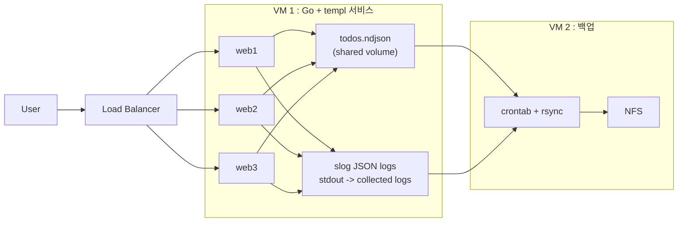

# ndjson-todo-lab

`Go + templ + nginx + NDJSON + slog`로 구성하는 실습용 Todo 웹 애플리케이션입니다.

이번 실습의 목적은 단순히 앱 하나를 띄우는 것이 아니라, 파일 기반 운영, 로드밸런싱, append-only 데이터 모델, 로그 수집, NFS 백업, 분리 가능한 인프라 레이어를 함께 경험하는 것입니다.

## 목표

- `templ`을 이용해 Go 웹서버를 직접 구성한다.
- `nginx`로 로드밸런싱을 구성한다.
- 리눅스, 컨테이너, 애플리케이션 구성을 모두 스크립트와 파일을 진실 원천으로 관리한다.
- 웹서버의 모든 로그를 수집해서 외부 볼륨과 `NFS`에 보관한다.
- `slog`를 실제로 사용해 운영 로그 구조를 확인한다.
- 요청 로그와 에러 로그는 모두 JSON 포맷으로 기록한다.
- 모든 구성이 나중에 여러 VM으로 분리 가능하도록 레이어 구조를 유지한다.
- 프로젝트 소개와 발표 자료는 `Slidev`로 구성한다.

## 레이어

- 웹서버 레이어
- nginx 레이어
- 로그 / 데이터 보관 레이어

## 구조



## 기술 선택

- 웹서버: `golang + templ`
- 로드밸런서: `nginx`
- 저장 방식: 단일 `todos.ndjson`
- 쓰기 방식: append-only
- 읽기 방식: 파일 전체 replay 후 메모리에서 현재 상태 구성
- 로그 방식: `slog -> stdout`
- 로그 포맷: 요청 로그 / 에러 로그 모두 JSON
- 백업 방식: `crontab + rsync + NFS`

## 왜 NDJSON append-only인가

- 단일 JSON overwrite보다 충돌 지점이 적습니다.
- 이벤트 로그처럼 변화 이력을 그대로 볼 수 있습니다.
- DB 없이도 상태 재구성을 실습할 수 있습니다.
- 나중에 snapshot, compaction 개념까지 이어가기 좋습니다.

중요한 점은 append-only가 동시성 문제를 완전히 없애는 것은 아니라는 점입니다. 이 실습의 의도는 overwrite 구조보다 더 추적 가능하고 다루기 쉬운 형태로 문제를 단순화하는 데 있습니다.

## 이벤트 모델

한 줄이 하나의 이벤트입니다. 현재 상태는 파일 하나를 처음부터 끝까지 읽어서 재구성합니다.

### 이벤트 타입

- `todo_created`
- `todo_title_changed`
- `todo_completed`
- `todo_reopened`
- `todo_deleted`

### 예시

```json
{"type":"todo_created","id":"t1","title":"buy milk","ts":"2026-04-23T10:00:00Z","server":"web1"}
{"type":"todo_completed","id":"t1","ts":"2026-04-23T10:05:00Z","server":"web2"}
{"type":"todo_title_changed","id":"t1","title":"buy oat milk","ts":"2026-04-23T10:06:00Z","server":"web3"}
```

### 읽기 규칙

- `todo_created`면 새 항목 생성
- `todo_title_changed`면 제목 수정
- `todo_completed`면 완료 처리
- `todo_reopened`면 다시 미완료 처리
- `todo_deleted`면 화면에서는 제거

### 필드 추천

- `type`
- `id`
- `title`
- `ts`
- `server`
- 선택: `request_id`

## 쓰기 / 읽기 흐름

### 쓰기

- 시작 시 `todos.ndjson`가 없으면 빈 파일 생성
- 웹 요청 수신
- 이벤트 1건 생성
- `todos.ndjson` 끝에 append
- 성공하면 `200` 또는 redirect

### 읽기

- 시작 시 파일 존재 여부 확인
- `todos.ndjson` 전체 읽기
- 줄 단위 JSON 파싱
- 메모리에서 최종 todo 상태 projection
- HTML 렌더링

### 이후 확장 포인트

- `snapshot.json` 주기적 생성
- 오래된 이벤트 압축(compaction)
- writer 전용 프로세스 분리
- request log와 todo event log 분리

## 서버 식별 정보 표시

로드밸런서 실습에서는 현재 어느 웹서버가 응답했는지를 사용자가 바로 알 수 있어야 합니다.

### 화면에 보여줄 값

- `SERVER_NAME`
- `hostname`
- `container name` 또는 container hostname
- `pid`
- 현재 시각

### 추천 표시 방식

- 상단 status card에 항상 고정 표시
- 예: `web2 / host=todo-web-2 / pid=1`
- 서버마다 배경색 또는 badge 색을 다르게 줄 수도 있음

## 로그 수집 계획

Todo 실습에서는 앱 상태 저장과 운영 로그를 분리해서 생각합니다.

### 역할 분리

- `todos.ndjson`
  - todo 상태 재구성용 이벤트 저장소
- `slog -> stdout`
  - 운영 로그, 요청 로그, 장애 로그를 JSON 포맷으로 출력

### 로그 방향

- Go 앱이 `slog JSONHandler(os.Stdout)`로 로그 출력
- 컨테이너 런타임이 `stdout/stderr`를 잡음
- VM1에서 로그 파일 또는 수집 디렉토리로 모음
- VM2에서 `crontab + rsync`로 주기 백업

### 로그 원칙

- 요청 로그는 모두 JSON
- 에러 로그도 모두 JSON
- 사람이 읽기 위한 텍스트 로그와 기계 수집용 로그를 분리하지 않고 JSON 하나로 통일
- 화면 식별 정보와 로그 식별 정보는 같은 값을 사용

### 로그 필드

- `ts`
- `level`
- `msg`
- `server`
- `hostname`
- `container`
- `pid`
- `request_id`
- `todo_id`
- `event_type`
- `remote_addr`

### 남길 로그 예시

- `todo appended`
- `todo replay started`
- `todo replay finished`
- `backup started`
- `backup finished`
- `append failed`

## 파일 구조

루트에서 전부 관리합니다.

- `main.go`
- `pages.templ`
- `todos.ndjson`

### 정책

- Go 로직은 `main.go` 단일 파일로 유지
- `templ`만 `pages.templ`로 분리
- 시작 시 `todos.ndjson`가 없으면 자동 생성
- shared volume도 루트의 `todos.ndjson`를 바라보게 구성

## 구현 체크리스트

- todo 목록 페이지
- todo 추가 form
- 완료 / 복구 버튼
- 삭제 버튼
- 현재 응답한 서버 식별 정보 표시
- LB가 웹서버 3대로 분산되는지 확인
- append-only로 이벤트가 잘 쌓이는지 확인
- 모든 서버가 같은 volume의 파일을 읽는지 확인
- 새로고침할 때 현재 상태가 올바르게 재구성되는지 확인
- 어느 웹서버가 응답했는지 화면에서 즉시 구분되는지 확인
- 백업 파일이 NFS 쪽으로 복사되는지 확인

## 발표 산출물

- 구현물
- 운영 / 구성 스크립트
- `Slidev` 기반 프로젝트 소개 자료

## 실제 VM 운영 스크립트

실제 2대 VM 테스트에서는 `docker compose`는 VM1 서비스 레이어만 담당하고, VM2는 호스트 레벨에서 NFS 서버를 구성합니다.

기본 `docker-compose.yml`은 로컬에서 바로 실행할 수 있도록 Docker named volume을 사용합니다. 실제 VM1에서는 `scripts/vm1/setup.sh`가 `docker-compose.vm1.yml` override를 함께 적용해서 `/srv/ndjson-todo/...` 호스트 경로를 bind mount합니다.

이번 실습에서는 여기까지를 범위로 두고, VM 운영 자동화는 셸 스크립트 수준까지만 다룹니다.

### 실제로 실행할 명령

- VM2 (`con2`, `10.10.10.50`): `sudo ENV_FILE=./scripts/vm2/vm2.env ./scripts/vm2/setup.sh`
- VM1 (`con1`, `10.10.10.40`): `sudo ENV_FILE=./scripts/vm1/vm1.env ./scripts/vm1/setup.sh`

처음에는 위 두 개만 기억하면 됩니다. 나머지 스크립트는 `setup.sh`가 내부에서 호출하는 세부 작업 단위입니다.

### VM2

- `scripts/vm2/vm2.env`
- `scripts/vm2/setup.sh`
- `scripts/vm2/status.sh`

`setup.sh`는 NFS 서버 패키지 설치, export 디렉터리 생성, `/etc/exports.d/ndjson-todo.exports` 작성, 서비스 기동, 방화벽 오픈까지 한 번에 처리합니다.

### VM1

- `scripts/vm1/vm1.env`
- `scripts/vm1/setup.sh`
- `scripts/vm1/status.sh`

`setup.sh`는 NFS 클라이언트 설치, NFS 마운트, 서비스 디렉터리 준비, backup cron 등록, `docker compose` 기동까지 한 번에 처리합니다. 수동 백업 테스트는 `scripts/vm1/backup-now.sh`로 할 수 있습니다.

## 한계점

- 현재 VM 운영 자동화는 셸 스크립트 기반입니다.
- 패키지 설치, 방화벽, mount, cron, 서비스 설정이 늘어날수록 스크립트는 빠르게 복잡해집니다.
- 실제 운영 환경에서는 이런 구성을 `Ansible` 같은 설정 관리 도구로 옮기는 편이 더 적합합니다.
- 이번 실습에서는 그 단계까지 확장하지 않고, 스크립트 기반 구성까지만 실습 범위에 포함합니다.
