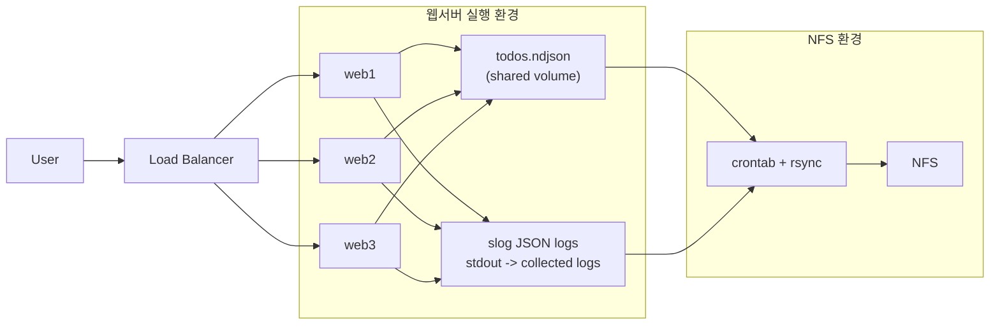

# ndjson-todo-lab

## 소개

`Go + templ + nginx + NDJSON + slog`로 구성하는 실습용 Todo 웹 애플리케이션입니다.

레포는 모노레포로 정리되어 있습니다. Todo 서비스는 `apps/todo-service`, 발표 자료는 `apps/slides`에서 함께 관리합니다.

이번 실습의 목적은 단순히 앱 하나를 띄우는 것이 아니라, 파일 기반 운영, 로드밸런싱, append-only 데이터 모델, 로그 수집, NFS 백업, 분리 가능한 인프라 레이어를 함께 경험하는 것입니다.

## 목표

- `templ`을 이용해 Go 웹서버를 직접 구성한다.
- `nginx`로 로드밸런싱을 구성한다.
- 리눅스, 컨테이너, 애플리케이션 구성을 모두 스크립트와 파일을 진실 원천으로 관리한다.
- 웹서버의 모든 로그를 수집해서 외부 볼륨과 `NFS`에 보관한다.
- `slog`를 실제로 사용해 운영 로그 구조를 확인한다.
- 요청 로그와 에러 로그는 모두 JSON 포맷으로 기록한다.
- 모든 구성이 나중에 여러 VM으로 분리 가능하도록 레이어 구조를 유지한다.
- 프로젝트 소개와 발표 자료는 `Slidev`로 구성한다.

## 실행 방법

- 앱 로컬 실행: `cd apps/todo-service && go run .`
- 전체 서비스 실행: `docker compose up --build`
- Slidev 개발 서버: `pnpm install && pnpm slides:dev`
- Slidev PPTX export: `pnpm slides:export:pptx`
- NFS 서버 환경 구성: `sudo ./scripts/nfs-server/setup.sh`
- 웹서버 실행 환경 구성: `sudo ./scripts/web-server/setup.sh`

## 구조

```text
.
├── apps
│   ├── slides
│   │   ├── package.json
│   │   ├── slides.md
│   │   └── styles
│   └── todo-service
│       ├── Dockerfile
│       ├── go.mod
│       ├── main.go
│       ├── pages.templ
│       └── todos.ndjson
├── docker
├── nginx
├── scripts
├── docker-compose.yml
├── docker-compose.web-server.yml
├── go.work
├── package.json
└── pnpm-workspace.yaml
```


