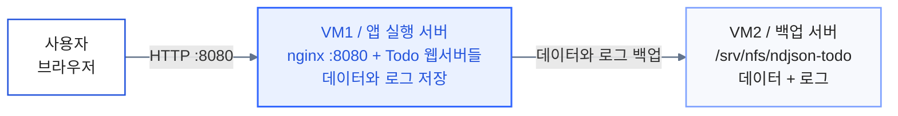
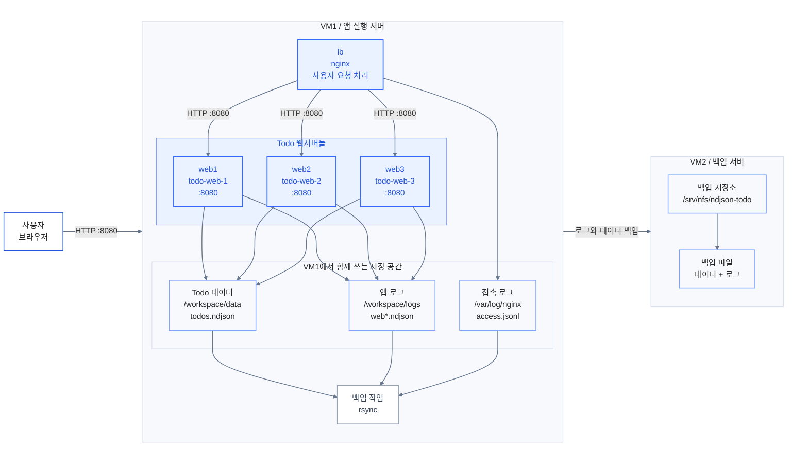

<style>
:root {
  /* Reference: apps/slides/public/images/2-블루-PPT-템플릿.pptx */
  --deck-blue: #3468ff;
  --deck-blue-strong: #2555dc;
  --deck-blue-soft: #eaf1ff;
  --deck-blue-line: #7fa2ff;
  --deck-ink: #252525;
  --deck-muted: #5f6673;
  --deck-faint: #d7dce5;
  --deck-surface: #ffffff;
  --deck-panel: #fbfcff;
  --deck-code: #f1f5fb;
  --deck-code-bg: #f6f8fb;
  --deck-code-border: #d8e0ee;
  --deck-code-text: #273348;
  --deck-code-muted: #7c8798;
  --deck-shadow: none;
  --deck-radius-sm: 4px;
  --deck-radius-md: 8px;
  --deck-radius-lg: 12px;
  --deck-pad-x: 54px;
  --deck-pad-y: 44px;
  --deck-rule: 2px solid var(--deck-blue);
  --deck-font-display: "IBM Plex Sans KR", "Arial Black", sans-serif;
  --deck-font-body: "IBM Plex Sans KR", sans-serif;
  --deck-font-mono: "JetBrains Mono", monospace;
  --deck-code-font-size: 0.66rem;
  --deck-code-font-size-tight: 0.54rem;
  --deck-code-line-height: 1.44;
}

.slidev-layout,
.slidev-layout * {
  box-sizing: border-box;
}

.slidev-layout {
  position: relative;
  overflow: hidden;
  padding: var(--deck-pad-y) var(--deck-pad-x);
  background: var(--deck-surface);
  color: var(--deck-ink);
  font-family: var(--deck-font-body);
}

.slidev-layout:not(:has(.title-hero))::before {
  content: "";
  position: absolute;
  inset: 0 0 auto;
  height: 34px;
  background: var(--deck-blue);
}

.slidev-layout h1,
.slidev-layout h2,
.slidev-layout h3 {
  color: var(--deck-ink);
  font-family: var(--deck-font-display);
  letter-spacing: -0.055em;
  line-height: 0.98;
}

.slidev-layout h1 {
  max-width: 880px;
  margin: 0 0 28px;
  font-size: 4.35rem;
  font-weight: 900;
}

.slidev-layout h2 {
  margin: 18px 0 26px;
  font-size: 2.45rem;
  font-weight: 900;
}

.slidev-layout h3 {
  margin: 0 0 14px;
  font-size: 1.2rem;
  font-weight: 800;
}

.slidev-layout p,
.slidev-layout li {
  color: var(--deck-muted);
  font-size: 0.98rem;
  line-height: 1.5;
}

.slidev-layout strong,
.slidev-layout em {
  color: var(--deck-blue);
  font-style: normal;
  font-weight: 900;
}

.slidev-layout code {
  border-radius: 8px;
  background: rgb(52 104 255 / 0.08);
  color: var(--deck-blue-strong);
  font-family: var(--deck-font-mono);
  font-weight: 650;
}

.slidev-layout pre {
  width: 100%;
  max-width: 100%;
  max-height: 390px;
  margin: 0;
  overflow: auto;
  border: 1px solid var(--deck-code-border);
  border-radius: var(--deck-radius-sm);
  background: var(--deck-code-bg) !important;
  box-shadow: none;
}

.slidev-layout pre code {
  display: block;
  min-width: 0;
  padding: 16px 18px;
  border-radius: 0;
  background: transparent;
  color: var(--deck-code-text);
  font-family: var(--deck-font-mono);
  font-size: var(--deck-code-font-size);
  font-weight: 650;
  line-height: var(--deck-code-line-height);
  white-space: pre-wrap;
  overflow-wrap: anywhere;
  word-break: normal;
}

.slidev-layout pre code span {
  color: inherit !important;
}

.slidev-layout pre code .line {
  min-height: 0;
}

.slidev-layout hr {
  border: 0;
  border-top: var(--deck-rule);
}

.lab-cover {
  display: flex;
  align-items: center;
  background: var(--deck-blue);
  color: #ffffff;
}

.title-hero {
  width: min(880px, 78%);
}

.deck-kicker {
  margin: 0 0 30px;
  color: rgb(255 255 255 / 0.78) !important;
  font-family: var(--deck-font-display);
  font-size: 1rem !important;
  font-weight: 800;
  letter-spacing: 0.18em;
  text-transform: uppercase;
}

.title-hero h1 {
  margin: 0 0 28px;
  color: #ffffff;
  font-size: 5.15rem;
  line-height: 0.91;
  text-wrap: balance;
}

.title-stack {
  margin: 0 0 22px;
  color: rgb(255 255 255 / 0.86) !important;
  font-family: var(--deck-font-mono);
  font-size: 0.95rem !important;
  letter-spacing: 0.02em;
}

.title-subtitle {
  max-width: 720px;
  margin: 0;
  color: rgb(255 255 255 / 0.86) !important;
  font-size: 1.15rem !important;
  line-height: 1.7 !important;
}

.hero-meta {
  display: flex;
  flex-wrap: wrap;
  gap: 12px;
  margin-top: 34px;
}

.hero-meta span {
  border: 1px solid rgb(255 255 255 / 0.68);
  border-radius: 999px;
  padding: 8px 15px;
  background: transparent;
  color: #ffffff;
  font-size: 0.78rem;
  font-weight: 800;
  letter-spacing: -0.01em;
}

.lab-grid,
.ops-columns {
  display: grid;
  grid-template-columns: repeat(2, minmax(0, 1fr));
  gap: 18px;
}

.lab-grid.single-row {
  grid-template-columns: repeat(2, minmax(0, 1fr));
}

.lab-card {
  position: relative;
  min-height: 150px;
  border: 1px solid var(--deck-faint);
  border-radius: var(--deck-radius-md);
  padding: 24px;
  background: var(--deck-surface);
  box-shadow: var(--deck-shadow);
}

.lab-card::before {
  content: none;
}

.lab-card h3 {
  color: var(--deck-blue);
}

.diagram-center {
  display: flex;
  align-items: center;
  justify-content: center;
  height: 396px;
  min-height: 0;
  max-height: 396px;
  overflow: hidden;
  border: 1px solid var(--deck-faint);
  border-radius: var(--deck-radius-lg);
  background: #ffffff;
  box-shadow: var(--deck-shadow);
}

.diagram-center .mermaid {
  display: flex;
  align-items: center;
  justify-content: center;
  width: 100%;
  height: 100%;
}

.diagram-center svg {
  max-width: 96%;
  max-height: 360px;
}

.result-shot {
  overflow: hidden;
  border: 1px solid var(--deck-faint);
  border-radius: var(--deck-radius-lg);
  background: #ffffff;
  box-shadow: var(--deck-shadow);
}

.lab-section,
.lab-statement,
.lab-fact {
  display: flex;
  flex-direction: column;
  justify-content: center;
}

.lab-section {
  background: var(--deck-blue);
  color: #ffffff;
}

.lab-section::before,
.lab-statement::before,
.lab-fact::before {
  content: none !important;
}

.lab-section h1,
.lab-section h2,
.lab-section p {
  color: #ffffff;
}

.lab-section h1,
.lab-section h2 {
  max-width: 900px;
  font-size: 5.1rem;
}

.lab-statement h1,
.lab-statement h2 {
  max-width: 1060px;
  font-size: 4.6rem;
  line-height: 0.96;
}

.lab-fact h1 {
  color: var(--deck-blue);
  font-size: 7rem;
  line-height: 0.86;
}

.lab-fact p {
  max-width: 760px;
  margin-top: 18px;
  font-size: 1.16rem;
}

.lab-image-right {
  display: grid;
  grid-template-columns: minmax(0, 0.92fr) minmax(0, 1.08fr);
  gap: 44px;
  align-items: center;
}

.lab-image-copy,
.lab-image-frame {
  min-width: 0;
}

.lab-image-frame {
  overflow: hidden;
  border: 1px solid var(--deck-faint);
  border-radius: var(--deck-radius-lg);
}

.lab-image-frame img {
  display: block;
  width: 100%;
  height: 100%;
  object-fit: cover;
}

.result-shot img {
  display: block;
  width: 100%;
  height: auto;
}

.lab-two-cols-header {
  display: grid;
  grid-template-rows: auto minmax(0, 1fr);
  gap: 18px;
}

.lab-slide-header {
  min-width: 0;
}

.lab-slide-header h2 {
  margin-bottom: 8px;
  border-bottom: var(--deck-rule);
  padding-bottom: 20px;
}

.lab-slide-header p {
  max-width: 940px;
}

.lab-two-cols {
  display: grid;
  grid-template-columns: minmax(0, 1fr) minmax(0, 1fr);
  gap: 56px;
  min-height: 0;
}

.lab-pane {
  min-width: 0;
  max-width: 100%;
  overflow: hidden;
  container-type: inline-size;
}

.lab-pane-left {
  padding-right: 12px;
}

.lab-pane-right {
  padding-left: 12px;
}

.slidev-layout.two-cols-header .grid {
  column-gap: 56px !important;
}

.slidev-layout.two-cols-header .col-left,
.slidev-layout.two-cols-header .grid > *:first-child {
  padding-right: 18px;
}

.slidev-layout.two-cols-header .col-right,
.slidev-layout.two-cols-header .grid > *:last-child {
  padding-left: 18px;
}

.slidev-layout.two-cols-header .col-left pre,
.slidev-layout.two-cols-header .col-right pre,
.slidev-layout.two-cols-header .grid > * pre {
  width: 100%;
  margin-left: 0;
  margin-right: 0;
}

.lab-pane h3 {
  margin-bottom: 12px;
  font-size: 1.04rem;
}

.lab-pane p,
.lab-pane li {
  font-size: 0.9rem;
  line-height: 1.46;
}

.lab-pane pre {
  max-height: 342px;
  border-radius: var(--deck-radius-sm);
}

.lab-pane pre code {
  padding: 13px 15px;
  font-size: var(--deck-code-font-size-tight);
  line-height: 1.38;
}

@container (max-width: 460px) {
  pre code {
    padding: 12px 13px;
    font-size: 0.5rem;
    line-height: 1.34;
  }
}
</style>

<!--
  일상적인 PT에서 사용되는 단어들로 수정해줘. 전문적인 용어보다는 이해하기 쉽게.
-->

<!--
  이번 프로젝트의 목표는 무엇인가? 24시간 무중단으로 사용자에게 TODO앱에 사용자 안전성 올리기.
  그렇다면 핵심 포인트는 golang 앱이 중심이 아니라 어떻게 사용자들에게 안정적으로 서비스를 제공하면서
  운영적으로 데이터가 잘 보존되고 백업될수있는지, 문제가 발생했을때 로그 분석을 통해 사후 대응이 가능한지가
  주요 키포인트이다.

  제목도 너무 아쉽다. 그리고 제목이 화면 중앙 배치로 되어버려서, 왼쪽 상단에 제목이 위치해야한다.
-->

<div class="title-hero">
  <p class="deck-kicker">NDJSON Todo Lab</p>
  <h1>Todo 앱으로 보는 서비스 운영 구조</h1>
  <p class="title-stack">Go + templ + nginx + NDJSON + slog</p>
  <p class="title-subtitle">작은 Todo 앱을 예제로, 서비스를 안정적으로 운영하기 위한 트래픽, 데이터, 로그, 백업 구성을 살펴봅니다.</p>

  <div class="hero-meta">
    <span>Todo 앱</span>
    <span>트래픽 분산</span>
    <span>주기적 백업</span>
  </div>
</div>

---

<!--
  프로젝트 소개 페이지가 아예 없어서 이게 무엇인지 알수가없다.
  무엇을 만들려고하는것인지, 어떠한 문제를 해결하려고 하는지에 대한 설명이 없다.
  그냥 그림만 던져주고 이게 뭐냐면 이렇다 저렇다 하는데, 듣는사람입장에선  무슨 말인지 모르겠다.
-->

## 이 프로젝트는 무엇인가요?

Todo 앱 하나를 여러 개의 웹서버로 실행하고, 어떤 서버가 요청을 처리해도 같은 데이터를 응답하는 구조를 실습합니다.

앱에서 생긴 데이터와 로그는 파일로 남기고, VM2에 백업해 둡니다. 문제가 생기면 이 파일로 상황을 확인합니다.

- 사용자는 Todo 앱에 접속합니다.
- VM1에서 실제 앱을 실행합니다.
- VM1에서 VM2로 데이터와 로그를 백업합니다.

---

## 목표

<!--
  진실 원천이라는 말을 우리가 쓰냐? 아니 안씀
-->

<div class="lab-grid">
  <div class="lab-card">
    <h3>서비스 구성</h3>
    <p>Go로 Todo 웹앱을 만들고, 저장된 데이터를 읽어 화면에 표시합니다.</p>
  </div>
  <div class="lab-card">
    <h3>트래픽 분산</h3>
    <p><code>nginx</code>가 사용자 요청을 여러 웹서버로 분산하도록 구성합니다.</p>
  </div>
  <div class="lab-card">
    <h3>로그와 백업</h3>
    <p>Todo 변경 내역과 서버 로그를 파일로 남기고, VM2로 백업합니다.</p>
  </div>
  <div class="lab-card">
    <h3>운영 내용</h3>
    <p>앱 구현보다 서비스를 운영할 때 필요한 저장, 로그, 백업 구조에 집중합니다.</p>
  </div>
</div>

---

## 전체 구조

사용자는 VM1의 Todo 앱에 접속합니다. VM1에서는 <code>nginx</code>가 요청을 받아 여러 웹서버로 분산하고, 데이터와 로그를 VM2로 백업합니다.

<div class="diagram-center">

<!-- 전체구조 그림만 띡하고 나오는데 보는 사람 입장에서는 이게 무엇을 말하는지, 알기가 너무 어렵다.
그리고 mermaid 만으로는 전체 구조를 좋은 구조로 표현하는것은 명백하게 한계가 있다. 이 방법은
가능하다면 사용하지 않는것이 좋을수도 있겠다.
-->
<!-- 2열 레이아웃으로하고,  오른쪽에 전체 구조에 대한 설명이 들어갔으면 훨씬 좋았을거같다. -->



</div>

---
layout: two-cols-header
---

<!--
  마찬가지로 코드 파일이 없다.
-->

## 프로젝트 구성

앱 실행, <code>nginx</code> 설정, VM별 설치 스크립트를 분리해서 관리합니다. 왼쪽은 서비스 실행에 필요한 파일이고, 오른쪽은 각 VM에서 직접 실행하는 스크립트입니다.

::left::

### 서비스 구성 파일

```text
.
├── apps
│   └── todo-service
│       └── Dockerfile
├── docker
│   └── nginx
│       └── Dockerfile
├── nginx
│   └── nginx.conf
├── scripts
│   ├── nfs-server
│   └── web-server
├── docker-compose.yml
└── docker-compose.web-server.yml
```

::right::

### VM별 실행 스크립트

```text
scripts
├── nfs-server
│   ├── down.sh
│   ├── nfs-server.env
│   ├── nfs-server.env.example
│   ├── setup.sh
│   └── status.sh
└── web-server
    ├── backup-now.sh
    ├── down.sh
    ├── setup.sh
    ├── status.sh
    ├── web-server.env
    └── web-server.env.example
```

---

## VM1 내부 구조

<!-- 이것도 왼쪽에는 전체적인 설명을 오른쪽에는 자세한 구조도를 그렸으면 좋겠다. -->
<!-- 최대한 단순하게 표현하고,  보는 사람이 -->
<!-- 유저 접속 흐름도로 단순 구조로 그려넣기 -->
<!-- 왜 선이 곡선이야? -->

VM1 안에서는 사용자 요청을 처리하는 서버와 실제 Todo 앱 서버들이 함께 실행됩니다. 세 웹서버는 같은 데이터와 로그 저장 공간을 사용합니다.

<div class="diagram-center">



</div>

---
layout: two-cols-header
---

<!--
  compose 구성전에 vm2에 대한 소개가 먼저 나와야하지 않을까??
  그래야 나중에 백업에 대한 내용이 나와도 자연스러움


  compose 구성이 나오기전에 lb와 web1~web3가 아무런 설명없이 나온다. 이것이 왜 나오고 그다음 내용으로 왜
  compose 구성으로 시작되는지? 독자들에게 설명할수있어야한다.


  코드 파일중 일부가 있어서 알수가없음. 글자만 있어서 정확히 서비스가 어떻게 구성되는지 알수가없다.


-->

## VM1 서비스 구성

VM1에서는 사용자 요청을 처리하는 <code>lb</code>와 실제 Todo 앱을 실행하는 <code>web1~web3</code>를 함께 실행합니다.

::left::

```yaml
# docker-compose.yml
services:
  lb:
    build:
      dockerfile: docker/nginx/Dockerfile
    depends_on:
      - web1
      - web2
      - web3
    ports:
      - "${LB_PORT:-8080}:8080"

  web1:
    build:
      dockerfile: apps/todo-service/Dockerfile
    environment:
      SERVER_NAME: web1
      TODO_DATA_FILE: /workspace/data/todos.ndjson
```

::right::

### 설명

- <code>lb</code>는 외부 요청을 처리하는 <code>nginx</code> 컨테이너입니다.
- <code>depends_on</code>은 <code>web1~web3</code> 컨테이너를 먼저 시작합니다.
- <code>8080</code> 포트가 사용자가 접속하는 서비스 포트입니다.
- <code>web1~web3</code>는 같은 이미지를 사용하고 서버 이름만 다르게 실행합니다.
- <code>TODO_DATA_FILE</code>은 공통 데이터 파일 경로를 지정합니다.

---
layout: two-cols-header
---

## Dockerfile 구성

Todo 앱 이미지는 빌드 단계와 실행 단계를 분리합니다. 실행 이미지에는 컴파일된 바이너리와 데이터/로그 경로만 남깁니다.

::left::

```dockerfile
# apps/todo-service/Dockerfile
FROM golang:1.25.6-alpine AS build
WORKDIR /src/apps/todo-service
RUN go install github.com/a-h/templ/cmd/templ@v0.3.1001
RUN templ generate
RUN CGO_ENABLED=0 GOOS=linux go build -o /out/ndjson-todo-lab .

FROM alpine:3.22 AS runtime
COPY --from=build /out/ndjson-todo-lab /usr/local/bin/ndjson-todo-lab
ENV ADDR=:8080
ENV TODO_DATA_FILE=/workspace/data/todos.ndjson
VOLUME ["/workspace/data", "/workspace/logs"]
EXPOSE 8080
CMD ["ndjson-todo-lab"]
```

::right::

### 설명

- <code>build</code> 단계에서 <code>templ</code> 결과와 Go 바이너리를 생성합니다.
- <code>runtime</code> 단계에는 실행에 필요한 바이너리만 넣습니다.
- <code>/workspace/data</code>와 <code>/workspace/logs</code>를 컨테이너 안의 데이터/로그 경로로 사용합니다.
- <code>TODO_DATA_FILE</code>은 compose에서 연결한 volume 경로를 사용합니다.
- 최종 컨테이너는 <code>8080</code> 포트에서 앱을 실행합니다.

---
layout: two-cols-header
---

## 공유 데이터 구성

기본 compose에서는 세 웹서버가 같은 named volume을 사용합니다. VM1용 compose 파일에서는 이 volume을 실제 서버 경로로 연결합니다.

::left::

### 기본 compose

```yaml
# docker-compose.yml
web1:
  volumes:
    - todo_data:/workspace/data
    - todo_logs:/workspace/logs

lb:
  volumes:
    - nginx_logs:/var/log/nginx

volumes:
  todo_data:
  todo_logs:
  nginx_logs:
```

::right::

### VM1 실행 경로

```yaml
# docker-compose.web-server.yml
web1:
  volumes:
    - ${TODO_DATA_DIR:-/srv/ndjson-todo/data}:/workspace/data${CONTAINER_BIND_OPTIONS:-:Z}
    - ${TODO_LOG_DIR:-/srv/ndjson-todo/logs}:/workspace/logs${CONTAINER_BIND_OPTIONS:-:Z}
```

<p><code>web2</code>, <code>web3</code>도 같은 VM1 경로를 사용하므로 Todo 데이터와 앱 로그가 한 곳에 모입니다.</p>

---

## 데이터 저장 방식

```json
{"type":"todo_created","id":"t1","title":"buy milk","ts":"2026-04-23T10:00:00Z","server":"web1"}
{"type":"todo_completed","id":"t1","ts":"2026-04-23T10:05:00Z","server":"web2"}
{"type":"todo_title_changed","id":"t1","title":"buy oat milk","ts":"2026-04-23T10:06:00Z","server":"web3"}
```

<div class="lab-grid single-row">
  <div class="lab-card">
    <h3>변경 이력 저장</h3>
    <p>Todo를 만들거나 완료하거나 제목을 바꾸면, 그 순간의 변경 내역을 한 줄씩 파일에 저장합니다.</p>
  </div>
  <div class="lab-card">
    <h3>데이터 일관성</h3>
    <p>어느 웹서버가 요청을 처리하더라도 같은 저장 공간을 사용하므로, 사용자는 동일한 Todo 목록을 보게 됩니다.</p>
  </div>
</div>

<!-- 이벤트가 기록이 되는데 핵심은 이 프로젝트에서 만큼은  shared volume에 저장되고 그것이 NFS에 백업된다는것이 핵심이다. -->
<!-- 어떤 웹서버를 들어도든  이벤트 단위로 기록되므로 동일성이 보장되는것이 핵심임.  -->
<!-- replay는 중요한 주제긴 하지만 여기선 핵심으로 드러내는 목표가 아니기 때문에 제외해야함. -->
<!-- -->

---

<!--
  여기선 글로만 하는것이 아니라 실제  Volume과 NFS를 이미지 시각 다이어그램으로 보여주면서
  어떻게 동작하는지 설명할 필요가 있다.  그래야 더 직관적으로 이해할수있다.
-->

<!--
  코드가 없어서 어떻게 되었는지 알수가 없으니 유추할수 밖에 없다. 코드 블럭이 있어야한다.

-->

## 데이터 저장 및 백업

<div class="ops-columns">
  <div class="lab-card">
    <h3>VM1</h3>
    <ul>
      <li>Todo 앱을 실행하는 서버입니다.</li>
      <li><code>/srv/ndjson-todo/data</code>에는 Todo 데이터가 저장됩니다.</li>
      <li><code>/srv/ndjson-todo/logs</code>에는 앱 로그와 <code>nginx</code> 로그가 모입니다.</li>
    </ul>
  </div>
  <div class="lab-card">
    <h3>VM2</h3>
    <ul>
      <li>VM1의 데이터와 로그를 백업하는 서버입니다.</li>
      <li><code>/srv/nfs/ndjson-todo</code> 경로를 백업 저장소로 사용합니다.</li>
      <li>앱 실행 경로와 백업 경로를 분리합니다.</li>
    </ul>
  </div>
</div>

---

## VM1 실행 결과

VM1에서 compose 구성을 실행하면, 브라우저에서 Todo 앱에 접속할 수 있습니다.

<div class="result-shot">
  
</div>

---

## 정리

<div class="ops-columns">
  <div class="lab-card">
    <h3>핵심</h3>
    <ul>
      <li>Todo 앱 자체보다, 여러 웹서버로 서비스를 운영하는 구조가 중심입니다.</li>
      <li>사용자는 하나의 주소로 접속하지만, 내부에서는 여러 웹서버가 요청을 분산 처리합니다.</li>
      <li>모든 웹서버가 같은 데이터 파일을 사용하므로 Todo 목록이 동일하게 유지됩니다.</li>
      <li>데이터와 로그를 VM2로 백업해 두고, 장애가 난 뒤 원인을 확인합니다.</li>
    </ul>
  </div>

  <!--
    - 파일을 확인해보지 않았는데 많은지 안많은지 어떻게 알음?
    - 가상 머신으로 실행은 했지만, 컨테이너가 주요 대상이므로  컨테이너가 장애 발생할시 발생하는 고가용성에 대해서 언급하는게 더 좋다.
  -->

  <div class="lab-card">
    <h3>현재 한계</h3>
    <ul>
      <li>VM1 한 대에 앱 실행이 모여 있어, VM1 자체가 멈추면 서비스도 멈춥니다.</li>
      <li>데이터베이스를 따로 두지 않아 데이터가 웹서버의 파일 경로에 남습니다.</li>
      <li>개발 환경과 운영 환경을 더 명확히 분리하면 배포를 관리하기 쉬워집니다.</li>
    </ul>
  </div>
</div>
