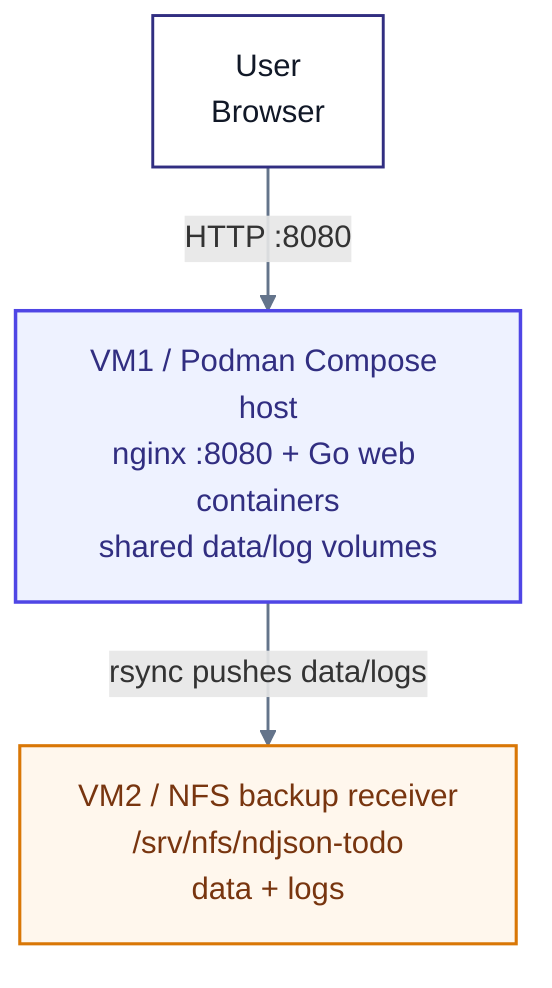
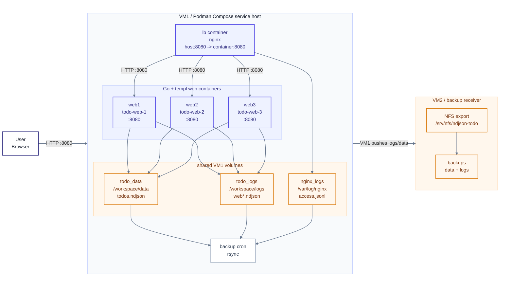

# ndjson-todo-lab

Go + templ + nginx + NDJSON + slog

작은 Todo 앱 하나를 통해
파일 기반 운영, 이벤트 기록, 로그 수집, NFS 백업까지 한 번에 실습하는 프로젝트

<div class="hero-meta">
  <span>Go Web App</span>
  <span>Append-only Data</span>
  <span>Load Balancing</span>
  <span>Monorepo + Slidev</span>
</div>

---

## 목표

<div class="lab-grid">
  <div class="lab-card">
    <h3>애플리케이션</h3>
    <p><code>templ</code> 기반 Go 웹서버를 직접 구성하고, 현재 상태를 파일 replay로 복원합니다.</p>
  </div>
  <div class="lab-card">
    <h3>인프라</h3>
    <p><code>nginx</code> 로드밸런싱과 다중 웹 인스턴스를 통해 서버 식별성과 분산 흐름을 확인합니다.</p>
  </div>
  <div class="lab-card">
    <h3>운영</h3>
    <p>운영 로그를 JSON으로 수집하고, VM2의 <code>NFS</code>로 백업하는 흐름을 다룹니다.</p>
  </div>
  <div class="lab-card">
    <h3>학습 포인트</h3>
    <p>단일 앱 구현보다, 파일과 스크립트를 진실 원천으로 두는 운영 감각을 익히는 데 집중합니다.</p>
  </div>
</div>

---

## 전체 구조

<div class="diagram-center">



</div>

---

## VM1 내부 구조

<div class="diagram-center">



</div>

---

## VM1 실행 결과

<div class="result-shot">
  
</div>

---

## 특징

```json
{"type":"todo_created","id":"t1","title":"buy milk","ts":"2026-04-23T10:00:00Z","server":"web1"}
{"type":"todo_completed","id":"t1","ts":"2026-04-23T10:05:00Z","server":"web2"}
{"type":"todo_title_changed","id":"t1","title":"buy oat milk","ts":"2026-04-23T10:06:00Z","server":"web3"}
```

<div class="lab-grid single-row">
  <div class="lab-card">
    <h3>이벤트 단위 기록</h3>
    <p>생성, 완료, 제목 변경 같은 사용자 행동을 상태 덮어쓰기가 아니라 이벤트 라인으로 남깁니다.</p>
  </div>
  <div class="lab-card">
    <h3>Replay 기반 상태</h3>
    <p>현재 상태는 이벤트 순서를 다시 읽어 projection 하며, <code>server</code>와 <code>ts</code>로 처리 흐름을 추적합니다.</p>
  </div>
</div>

---

## Compose 구성

<div class="ops-columns">
  <div class="lab-card">
    <h3>서비스 배치</h3>
    <ul>
      <li><code>lb</code>는 nginx reverse proxy입니다.</li>
      <li><code>web1~web3</code>는 같은 Todo 이미지를 실행합니다.</li>
      <li>nginx upstream이 세 웹 컨테이너로 요청을 분산합니다.</li>
    </ul>
  </div>
  <div class="lab-card">
    <h3>공유 지점</h3>
    <ul>
      <li><code>todo_data</code>는 웹 컨테이너들이 공유하는 Todo 이벤트 데이터입니다.</li>
      <li><code>todo_logs</code>는 웹 컨테이너 로그입니다.</li>
      <li><code>nginx_logs</code>는 reverse proxy access log입니다.</li>
    </ul>
  </div>
</div>

---

## Volume과 NFS 경계

<div class="ops-columns">
  <div class="lab-card">
    <h3>VM1</h3>
    <ul>
      <li><code>docker-compose.vm1.yml</code>이 named volume을 VM1 host path로 바꿉니다.</li>
      <li><code>/srv/ndjson-todo/data</code>는 웹 컨테이너들이 공유하는 데이터 경로입니다.</li>
      <li><code>/srv/ndjson-todo/logs</code>는 web/nginx 로그가 모이는 경로입니다.</li>
    </ul>
  </div>
  <div class="lab-card">
    <h3>VM2</h3>
    <ul>
      <li><code>/srv/nfs/ndjson-todo</code>를 NFS export로 제공합니다.</li>
      <li>VM1의 data/log 백업을 받는 저장소 역할을 합니다.</li>
      <li>애플리케이션 쓰기 경로와 백업 경로를 분리합니다.</li>
    </ul>
  </div>
</div>

---

## Dockerfile / Compose / Scripts

```text
.
├── apps
│   └── todo-service/Dockerfile
├── docker
│   └── nginx/Dockerfile
├── nginx
│   └── nginx.conf
├── scripts
│   ├── lib/common.sh
│   ├── vm1
│   └── vm2
├── docker-compose.yml
└── docker-compose.vm1.yml
```

- `Dockerfile`은 애플리케이션 이미지와 nginx 이미지를 분리합니다.
- `compose`는 컨테이너 배치, 포트, 로그, 데이터 volume을 선언합니다.
- `scripts/vm1`과 `scripts/vm2`는 VM별 운영 경계를 파일 구조로 드러냅니다.

---

## 정리

<div class="ops-columns">
  <div class="lab-card">
    <h3>핵심</h3>
    <ul>
      <li>Todo 화면보다 <code>compose + volume + NFS</code> 운영 구조가 중심입니다.</li>
      <li>이벤트 단위 기록과 replay로 분산 웹서버의 상태 관리 문제를 다룹니다.</li>
      <li><code>Dockerfile</code>, <code>compose</code>, <code>scripts</code>가 VM1 실행 경계와 VM2 백업 경계를 설명합니다.</li>
    </ul>
  </div>
  <div class="lab-card">
    <h3>명확한 한계</h3>
    <ul>
      <li>한 번의 스크립트 실행으로 VM 환경을 구성하면서 스크립트 수가 많아졌고, 개발/운영 환경의 동일성을 보장하지 못합니다.</li>
      <li>빌드 및 배포 환경과 실행 환경이 명확히 분리되지 않았습니다. 운영에서는 배포된 이미지로 실행만 해야 합니다.</li>
      <li>서비스 실행이 VM1 한 대에 집중되어 머신 장애 시 고가용성을 제공하지 못합니다.</li>
      <li>데이터베이스 서버를 별도로 분리하지 않아 데이터가 웹서버 쪽 volume에 남습니다.</li>
    </ul>
  </div>
</div>
