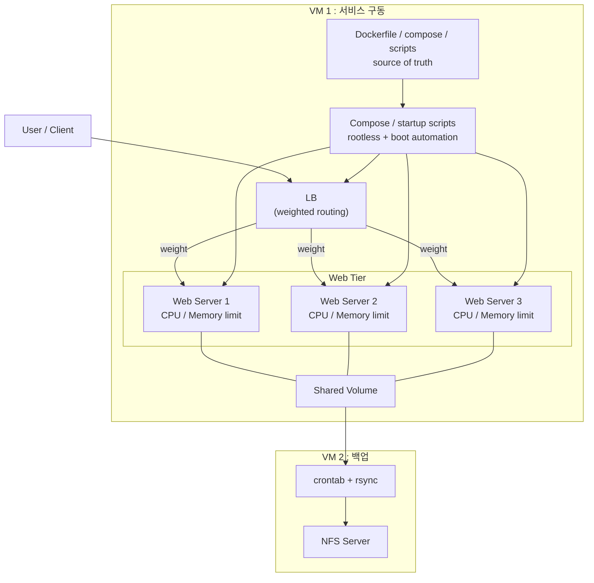
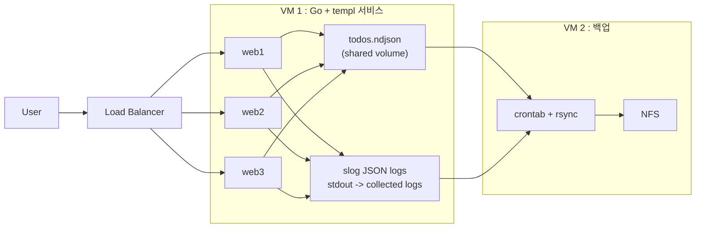

::: note {"id":"note-4","at":{"x":8436,"y":7206,"w":320}}
웹서버 구성 실습

제출형식

- 자유형식, 보고서든, 마크다운이든, PPT든

- LB
  - 가중치를 제공해서 웹서버를 시동
- 웹서버 3대
  - CPU 및 메모리 리소스 제한
- 볼륨 1개

# 제안

- Compose 를 구성하는 방법
- 부팅시 자동 구성 + rootless
- NFS를  다른 vmware에 추가해서 로컬로 주기적 백업 구성.  crontab으로 rsync 구성

모든 인프라 구성은 dockerfile, 스크립트 파일등으로 해서  진실 원천은 파일로
:::

::: note {"id":"webserver-lab-goals","at":{"x":7800,"y":7768,"w":980,"h":560}}
# 이번 실습의 목표

- `templ`을 이용해 Go 웹서버를 직접 구성해본다
- `nginx`로 로드밸런싱을 구성해본다
- 리눅스, 컨테이너, 애플리케이션 구성을 모두 스크립트와 파일을 진실 원천으로 관리한다
- 웹서버의 모든 로그를 수집해서 외부 볼륨과 `NFS`에 보관한다
- `slog`를 실제로 써보며 운영 로그 구조를 확인한다
- 모든 구성이 나중에 여러 VM으로 분리 가능하도록 레이어 구조를 유지한다
- 프로젝트 소개와 발표 자료는 `Slidev`로 구성한다

## 레이어 기준

- 웹서버 레이어
- nginx 레이어
- 로그 / 데이터 보관 레이어

## 실습 관점

- 단순히 앱 하나를 띄우는 것이 아니라
- 파일 기반 운영, 분리 가능한 구조, 로그 보관, 로드밸런싱까지 함께 경험하는 것이 목표다
- 최종 결과는 구현물과 함께 `Slidev` 소개 자료까지 남기는 것을 목표로 한다
:::

::: note {"id":"note-5","at":{"x":8848,"y":7220,"w":1220}}

:::

::: note {"id":"todo-ndjson-lab-overview","at":{"x":10110,"y":7206,"w":620,"h":560}}
# Todo 앱 실습 방향

이번 실습은 데이터베이스 없이 `Go + templ` 웹서버 3대와 shared volume 위의 `NDJSON` 파일을 이용해 todo 앱을 구성한다.

## 핵심 선택

- 웹서버: `golang + templ`
- 저장 방식: 단일 `todos.ndjson`
- 쓰기 방식: append-only
- 읽기 방식: 파일 전체 replay 후 메모리에서 현재 상태 구성
- 백업 방식: `crontab + rsync + NFS`

## 왜 이 방식인가

- 단일 JSON overwrite보다 충돌 지점이 적다
- 이벤트 로그처럼 변화 이력을 그대로 볼 수 있다
- DB 없이도 상태 재구성을 실습할 수 있다
- 나중에 snapshot, compaction 개념까지 이어가기 좋다
:::

::: note {"id":"todo-ndjson-event-model","at":{"x":10110,"y":7795,"w":760,"h":860}}
# NDJSON 이벤트 모델

한 줄이 하나의 이벤트다. 현재 상태는 파일 하나를 처음부터 끝까지 읽어서 재구성한다.

## 이벤트 타입

- `todo_created`
- `todo_title_changed`
- `todo_completed`
- `todo_reopened`
- `todo_deleted`

## 예시

```json
{"type":"todo_created","id":"t1","title":"buy milk","ts":"2026-04-23T10:00:00Z","server":"web1"}
{"type":"todo_completed","id":"t1","ts":"2026-04-23T10:05:00Z","server":"web2"}
{"type":"todo_title_changed","id":"t1","title":"buy oat milk","ts":"2026-04-23T10:06:00Z","server":"web3"}
```

## 읽기 규칙

- `todo_created`면 새 항목 생성
- `todo_title_changed`면 제목 수정
- `todo_completed`면 완료 처리
- `todo_reopened`면 다시 미완료 처리
- `todo_deleted`면 화면에서는 제거

## 필드 추천

- `type`
- `id`
- `title`
- `ts`
- `server`
- 선택: `request_id`
:::

::: note {"id":"todo-ndjson-read-write-flow","at":{"x":10910,"y":7206,"w":980,"h":980}}
# 쓰기 / 읽기 흐름

## 쓰기

- 시작 시 `todos.ndjson`가 없으면 빈 파일 생성
- 웹 요청 수신
- 이벤트 1건 생성
- `todos.ndjson` 끝에 append
- 성공하면 200 또는 redirect

## 읽기

- 시작 시 파일 존재 여부 확인
- `todos.ndjson` 전체 읽기
- 줄 단위 JSON 파싱
- 메모리에서 최종 todo 상태 projection
- HTML 렌더링

## 장점

- append-only라 구조가 단순하다
- 변경 이력 확인이 쉽다
- 어느 서버가 이벤트를 썼는지 기록 가능하다

## 주의점

- 여러 서버가 동시에 append할 때는 쓰기 제어가 필요하다
- 파일이 커질수록 전체 replay 비용이 커진다
- 운영 구조라기보다 학습용 구조에 가깝다

## 이후 확장 포인트

- `snapshot.json` 주기적 생성
- 오래된 이벤트 압축(compaction)
- writer 전용 프로세스 분리
- request log와 todo event log 분리
:::

::: note {"id":"todo-ndjson-go-templ-lab-checklist","at":{"x":11930,"y":7206,"w":760,"h":980}}
# Go + templ 구현 체크리스트

## 화면

- todo 목록 페이지
- todo 추가 form
- 완료 / 복구 버튼
- 삭제 버튼
- 현재 응답한 서버 식별 정보 표시

## 서버별 표시

- `SERVER_NAME=web1`
- `SERVER_NAME=web2`
- `SERVER_NAME=web3`
- 페이지에 서버명, hostname, 컨테이너 이름, PID, 현재 시각 출력

## 파일 구조 예시

- `main.go`
- `pages.templ`
- `todos.ndjson`

## 파일 생성 정책

- 루트에서 전부 관리
- Go 로직은 `main.go` 단일 파일로 유지
- `templ`만 `pages.templ`로 분리
- 시작 시 `todos.ndjson`가 없으면 자동 생성
- shared volume도 루트의 `todos.ndjson`를 바라보게 구성

## 실습에서 확인할 것

- LB가 웹서버 3대로 분산되는지
- append-only로 이벤트가 잘 쌓이는지
- 모든 서버가 같은 volume의 파일을 읽는지
- 새로고침할 때 현재 상태가 올바르게 재구성되는지
- 어느 웹서버가 응답했는지 화면에서 즉시 구분되는지
- 백업 파일이 NFS 쪽으로 복사되는지
:::

::: note {"id":"todo-server-identity-display","at":{"x":11930,"y":8220,"w":760,"h":760}}
# 웹서버 식별 정보 표시

LB 실습에서는 현재 어느 웹서버가 응답했는지를 사용자가 바로 알 수 있어야 한다.

## 화면에 보여줄 값

- `SERVER_NAME`
- `hostname`
- `container name` 또는 container hostname
- `pid`
- 현재 시각

## 추천 표시 방식

- 상단 status card에 항상 고정 표시
- 예: `web2 / host=todo-web-2 / pid=1`
- 서버마다 배경색 또는 badge 색을 다르게 줄 수도 있음

## 왜 필요한가

- LB 분산이 실제로 동작하는지 즉시 확인 가능
- 새로고침할 때 다른 서버로 넘어가는지 보인다
- 장애 시 특정 서버만 이상한지 구분하기 쉽다
- 로그와 화면의 식별자를 맞출 수 있다
:::

::: note {"id":"todo-slog-logging-plan","at":{"x":12730,"y":7206,"w":760,"h":900}}
# slog + stdout 로그 수집 계획

Todo 실습에서는 앱 상태 저장과 운영 로그를 분리해서 생각한다.

## 역할 분리

- `todos.ndjson`
  - todo 상태 재구성용 이벤트 저장소
- `slog -> stdout`
  - 운영 로그, 요청 로그, 장애 로그 출력

## 로그 방향

- Go 앱이 `slog JSONHandler(os.Stdout)`로 로그 출력
- 컨테이너 런타임이 stdout/stderr를 잡음
- VM1에서 로그 파일 또는 수집 디렉토리로 모음
- VM2에서 `crontab + rsync`로 주기 백업

## 로그에 남길 필드

- `ts`
- `level`
- `msg`
- `server`
- `hostname`
- `container`
- `pid`
- `request_id`
- `todo_id`
- `event_type`
- `remote_addr`

## 왜 분리하는가

- todo 이벤트는 앱 데이터다
- `slog` 로그는 운영 관찰 데이터다
- 둘을 분리해야 읽기 모델과 장애 분석이 덜 꼬인다
:::

::: note {"id":"todo-slog-log-cases","at":{"x":12730,"y":8135,"w":760,"h":860}}
# 어떤 로그를 남길까

## 요청 단위

- todo 목록 조회
- todo 생성 요청
- 완료 / 복구 / 삭제 요청
- 응답 상태 코드

## 파일 처리

- `todos.ndjson` append 성공
- append 실패
- 파일 열기 실패
- JSON decode 실패

## 운영 관점

- 서버 시작
- 서버 종료
- 백업 직전 파일 크기
- 백업 성공 / 실패
- shared volume 접근 실패

## 예시 메시지

- `todo appended`
- `todo replay started`
- `todo replay finished`
- `backup started`
- `backup finished`
- `append failed`
:::

::: note {"id":"todo-ndjson-lab-visual","at":{"x":10910,"y":8218,"w":980,"h":820}}
# Todo 앱 실습 구조


:::
